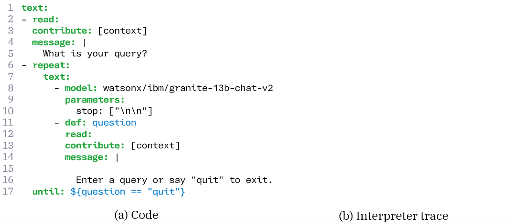
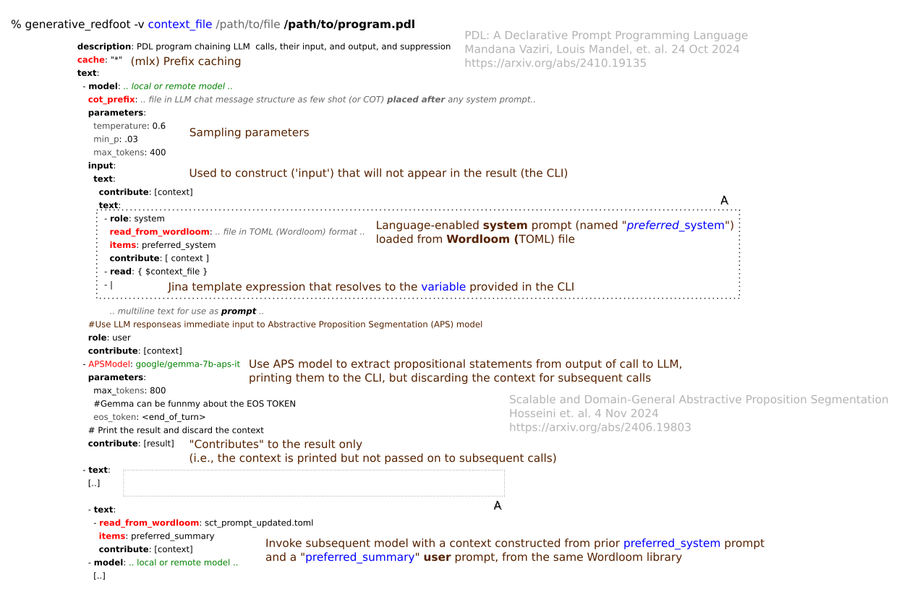

# Generative Redfoot
A generative, conversational workflow and multi-agent system using PDL and [mlx](https://github.com/ml-explore/mlx-examples/tree/main/llms)

Takes a minimal [Prompt Declaration Language (PDL)](https://github.com/IBM/prompt-declaration-language) file and generates a finite state generative machine
as Python objects for a subset of the PDL language.  These objects (the "programs" in particular) can be executed. 

It was mainly motivated by supporting this use case from the PDL documentation/paper:



The Model class can be extended and incorporated into how a dispatcher creates the PDL Python objects from a PDL file to incorporate the functionality for evaluating 
the prompts against the models specified in PDL.  The evaluation manages accumulated conversational context, prompts, and generation parameters (sampling parameters, for example), 
optionally updating the context as the program execution continues.  MLX is used to implement the model loading and inference.

However, the language of the PDL file can be extended with additional custom functionality and 
other LLM systems can handle the evaluation.

It depends on the PyYaml and click third-party Python libraries as well as MLX and can be run this way, where `document.pdl` is a PDL file.
```commandline
% Usage: generative_redfoot [OPTIONS] PDL_FILE

Options:
  -t, --temperature FLOAT
  -rp, --repetition-penalty FLOAT
                                  The penalty factor for repeating tokens
                                  (none if not used)
  --top_k INTEGER                 Sampling top_k
  --max_tokens INTEGER            Max tokens
  --min-p FLOAT                   Sampling min-p
  --verbose / --no-verbose
  -v, --variables <TEXT TEXT>...
  --help                          Show this message and exit.

generative_redfoot.py document.pdl
```

The main argument is a PDL document, possibly with extensions of the language implemented by generative_redfoot.

You can also specify default values for sampling parameters for the LLM calls during the execution of the programs
using MLX.

The model _parameters_ directive in PDL can be used to specify the following MLX generation parameters: **temperature**, **top_k**, **min_p**, **max_tokens**, and **top_p**:

```yaml
description: ...
text:
  - read:
    message: |
      What is your query?
    contribute: [context]
- model: .. model ..
  parameters:
    temperature: 0.6
    min_p: .03
    max_tokens: 200
```

## Other more complex examples

Below is an example showing a PDL file constructing message contexts for prompts to chained LLM calls from fragments
in a [Wordloom](https://github.com/OoriData/OgbujiPT/wiki/Word-Loom%3A-Format-%26-tools-for-managing-natural-language-for-AI-LLMs) 
library, providing a clean separation of concerns between prompt language management, prompt construction, and 
LLM workflow management and orchestration.  The keys in the YAML file in black use the PDL language.  Those in
red are generative_redfoot extensions shown in order of appearance: (MLX) prefix caching, COT few-shot loading, 
reading from a wordloom file, using Google's [__google/gemma-7b-aps-it__](https://huggingface.co/google/gemma-7b-aps-it) 
model to perform ["abstractive proposition segmentation"](https://arxiv.org/abs/2406.19803) from LLM output, 
etc.:


